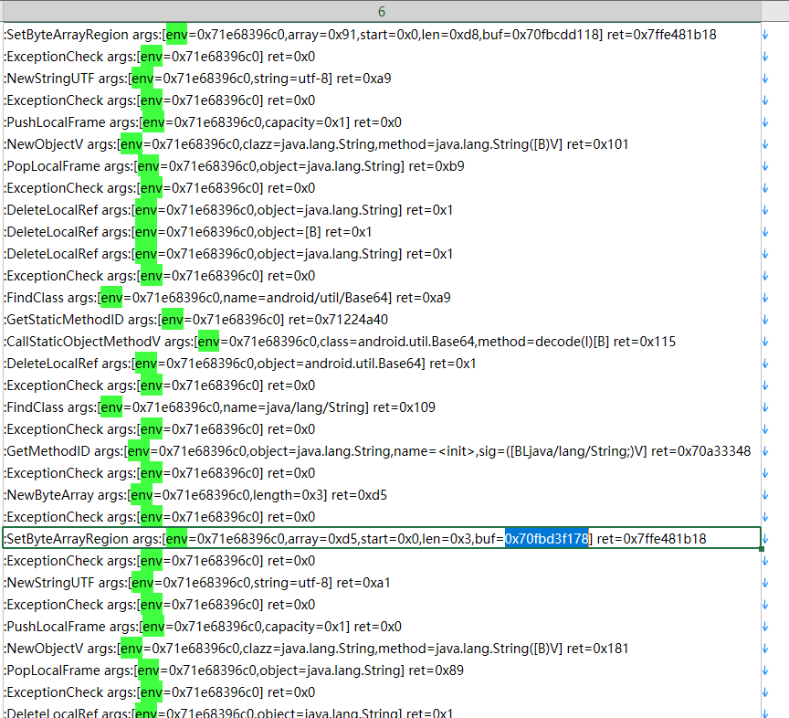
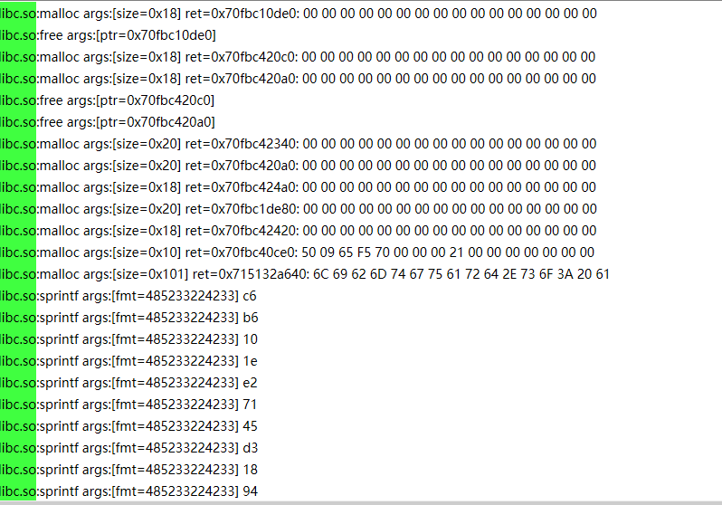

## What is it?

**This code repository does not provide any out-of-the-box tools.**
This repository is still under development.
This is an Android assembly instruction tracer, implemented based on QBDI and frida-gum. It is similar to Frida.Stalker
in functionality but faster than Frida.Stalker.

## Features

* Supports SVC instruction tracing, and can print the parameters of SVC instructions.
* Supports JNIEnv call tracing, and can print the parameters and return values of JNIEnv calls.
  
* Supports libc function tracing, and can print the parameters and return values of libc function calls.
  

## Build Environment

* [Android NDK r25c and Upper](https://developer.android.com/ndk/downloads)
* Android API 24 and Upper

## Development Environment

* [Android NDK r25c](https://developer.android.com/ndk/downloads)
* [CMake 3.22](https://cmake.org/download/)
* [Clion](https://www.jetbrains.com/clion/)

## Credits

* [QBDI](https://github.com/QBDI/QBDI)
* [xHook](https://github.com/iqiyi/xHook)
* [Xdl](https://github.com/hexhacking/xDL)
* [Dobby](https://github.com/jmpews/Dobby)

* [SimpleJNI](https://github.com/gershnik/SimpleJNI)